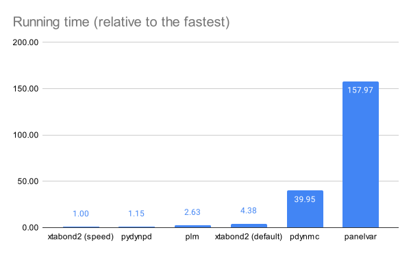
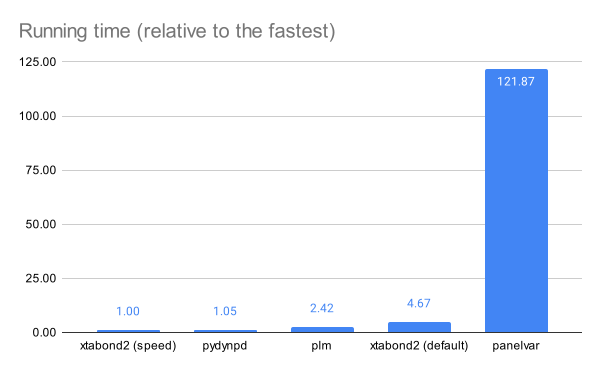

The objective of the package is similar to the following open-source packages: <br>
Package | Language | version
--- | --- | ---
plm | R |
panelvar | R| 0.5.3
pdynmc | R| 0.9.7

To compare pydynpd with similar packages, we performed two performance tests. More specifically, in each test for each package we run 100 times to estimate the same model with the same data. For verification, the tests also include Stata package xtabond2 though Stata is a commercial software. Please note that the main reason we include xtabond2 is for regression result verification (\*). Directly comparing its speed with R or Python packages is a little unfair because the calculation part of xtabond2 was compiled while pydynpd and the three R packages are interpreted; xtabond2 should have a clear advantage on speed. 

*Note: xtabond2 is the most popular package on dynamic panel model as evidenced by the 9667 citations it has received according to google scholar as of April 3, 2022. It also won 

## Test configuration
### Hardware
Intel CPU 9700K (8 cores) <br>
Memory: 64GB <br>

### Software
Debian-based Linux (Deepin 20.04) <br>
R 4.1.2 <br>
Python 3.9 <br>
<p>To make our comparison fair, we configured both R and Python to link to Intel's Math Kernal Libarary (MKL).</p>

Configuration of R:
```
> sessionInfo()
R version 4.1.2 (2021-11-01)
Platform: x86_64-pc-linux-gnu (64-bit)
Running under: Deepin 20.4

Matrix products: default
BLAS/LAPACK: /opt/intel/compilers_and_libraries_2020.4.304/linux/mkl/lib/intel64_lin/libmkl_gf_lp64.so
```
Configuration of Python Numpy:
```
numpy.show_config()
blas_armpl_info:
  NOT AVAILABLE
blas_mkl_info:
    libraries = ['mkl_rt', 'pthread', 'mkl_rt']
    library_dirs = ['/opt/intel/compilers_and_libraries/linux/mkl/lib/intel64']
    define_macros = [('SCIPY_MKL_H', None), ('HAVE_CBLAS', None)]
    include_dirs = ['/opt/intel/compilers_and_libraries/linux/mkl/include']
blas_opt_info:
    libraries = ['mkl_rt', 'pthread', 'mkl_rt']
    library_dirs = ['/opt/intel/compilers_and_libraries/linux/mkl/lib/intel64']
    define_macros = [('SCIPY_MKL_H', None), ('HAVE_CBLAS', None)]
    include_dirs = ['/opt/intel/compilers_and_libraries/linux/mkl/include']
```

<p>The tests are based on the data set employed in Arellano and Bond (1991) and is avaialble from R package panelvar. </p>

<p>In the tests, we considered the following model:</p>
 

We performed two tests on the model above. Test 1 is a difference GMM and test 2 a system GMM. Scripts and their results are stored in test_1.md and test_2.md respectively.


## Test 1: Difference GMM
There are four packages that produce the same regression result: plm, panelvar, pydynpd, and xtabond2. The result from pdynmc is slightly different. The table below compaires their speeds. Column 2 shows their running time in seconds per 100 loops, and column 3 calculates their relative speed (i.e, relative to the fastest package in the test). Please note that as xtabond2 was developed and compiled using Mata language, there are two different modes available in Stata. In the default mode, storage is favored over speed. But users can manually switch to the speed mode. Therefore, we report two speeds for xtabond2. More specifically, xtabond2 (default) balances with storage, while xtabond2 (speed) represents the fastest speed this package can achieve.


| Package            | Running Time | Relative to the fastest |
| ------------------ | ------------ | ----------------------- |
| xtabond2 (speed)   | 4.19         | 1.00                    |
| pydynpd            | 4.81         | 1.15                    |
| panelvar           | 661.893      | 157.97                  |
| plm                | 11.02        | 2.63                    |
| pdynmc             | 167.4        | 39.95                   |
| xtabond2 (default) | 18.369       | 4.38                    |



The chart above shows that our package (pydynpd) is not far behind of xtabond2 even though it is a interpreted package.


## Test 2: System GMM

In the second test, pydynpd produced the same regression results as those by xtabond2 and panelvar. plm has different results because it doesn't include constant term. On the other hand, we made several attempts but could not make R package pdynmc work; it kept on reporting the same error message (i.e., "Matrices must have same number of rows in cbind2(x, .Call(dense_to_Csparse, y)").

| Package            | Running Time | Relative to the fastest |
| ------------------ | ------------ | ----------------------- |
| xtabond2 (speed)   | 5.893        | 1.00                    |
| pydynpd            | 6.21         | 1.05                    |
| plm                | 14.26        | 2.42                    |
| xtabond2 (default) | 27.536       | 4.67                    |
| panelvar           | 718.2        | 121.87                  |
| pdynmc             | NA           | NA                      |




Their estimates and running times (i.e., total running time of 100 tests) are shown in table below. Scripts of this test are included in the "Benchmark" folder. 

